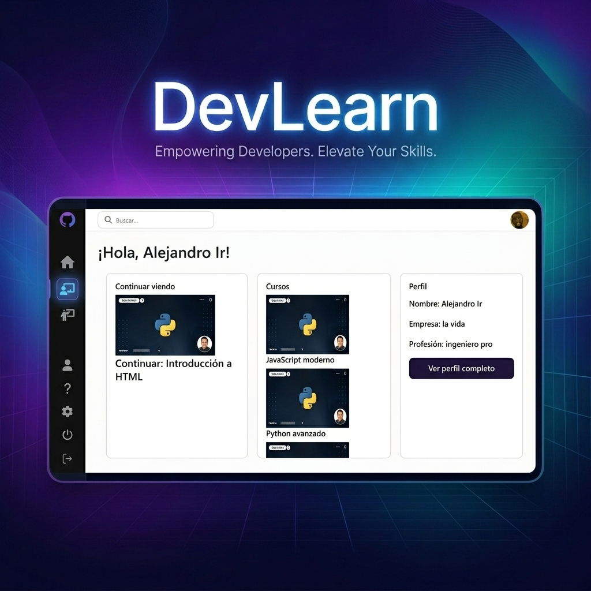

# DevLearn



Plataforma de aprendizaje en línea (e-learning) desarrollada con Django. El sistema permite a los instructores crear y gestionar cursos con contenido interactivo y estructurado, mientras que los estudiantes pueden inscribirse en ellos, realizar un seguimiento de su progreso y ponerse en contacto con el equipo de soporte.

---

## Características Principales

### 👤 Autenticación y Roles de Usuario
* **Modelo de Usuario Personalizado**: Se implementa un modelo de usuario extendido que añade un rol diferenciado para instructores (`is_instructor`).
* **Perfiles Automatizados**: Mediante señales de Django, la creación de un usuario genera de forma automática su perfil general (`Profile`) y, si aplica, su perfil de instructor (`InstructorProfile`).
* **Redirección por Rol**: Al iniciar sesión, el sistema redirige automáticamente al usuario según su rol (el instructor al panel de gestión y el estudiante al listado de cursos).

### 📚 Gestión y Visualización de Cursos
* **Estructura Modular**: Los cursos se dividen en módulos (capítulos) y estos a su vez en lecciones o contenidos específicos.
* **Contenido Polimórfico**: Se hace uso del framework de tipos de contenido de Django (`ContentType` y `GenericForeignKey`) para permitir que un módulo contenga distintos tipos de materiales:
  * 📝 **Texto**: Artículos con formato de texto.
  * 📎 **Archivos**: Documentos descargables (PDF, ZIP, etc.).
  * 🖼️ **Imágenes**: Material visual.
  * 🎥 **Videos**: Enlaces a plataformas externas (YouTube, Vimeo, etc.).
* **Ordenación Automática**: Se incluye un campo personalizado (`OrderField`) que calcula y asigna automáticamente la posición/orden de los módulos en un curso y de los contenidos en un módulo.

### 📈 Inscripciones y Seguimiento de Progreso
* **Inscripción única**: Los alumnos pueden inscribirse a los cursos disponibles una sola vez.
* **Seguimiento del Avance**: El sistema registra qué contenidos específicos han sido completados por cada alumno y calcula de forma dinámica el porcentaje de avance general del curso.
* **Valoraciones**: Los estudiantes inscritos pueden calificar y dejar reseñas en los cursos, actualizando la puntuación media global de cada curso.

### 📧 Sistema de Soporte
* **Formulario de Contacto**: Los usuarios autenticados pueden enviar consultas directamente desde la plataforma.
* **Notificaciones por Correo**: El sistema genera y envía correos electrónicos automatizados utilizando plantillas predefinidas hacia la bandeja de entrada configurada para el área de soporte.

---

## Estructura del Directorio

El proyecto se encuentra organizado de forma modular dentro de la carpeta `apps`:

```text
devlearn/
│
├── apps/
│   ├── courses/          # Núcleo de cursos, módulos, contenidos y valoraciones
│   │   ├── models/       # Modelos (Course, Module, Content, Enrollment, Progress, Review)
│   │   ├── urls/         # Rutas separadas para 'student' e 'instructor'
│   │   └── views/        # Lógicas de negocio para estudiantes e instructores
│   │
│   ├── dashboard/        # Panel de control del usuario y redirección inicial
│   │
│   ├── profiles/         # Gestión de usuarios, perfiles de estudiante e instructor
│   │   └── context_processors.py  # Procesador de contexto para cargar la foto de perfil de forma global
│   │
│   └── support/          # Sistema de soporte técnico y envío de correos
│
├── devlearn/             # Configuración principal de Django (settings, urls, wsgi)
├── media/                # Archivos subidos por los usuarios (fotos de perfil, etc.)
├── static/               # Archivos estáticos globales (CSS, JS, imágenes estáticas)
├── templates/            # Plantillas HTML globales
└── manage.py             # Script de administración de Django
```

---

## Requisitos Previos

Para ejecutar este proyecto, se requiere contar con lo siguiente:
* Python 3.10 o superior
* Base de datos compatible (por defecto se emplea SQLite3)
* Biblioteca de procesamiento de imágenes `Pillow` (para la gestión de fotos de perfil)
* `python-dotenv` (para la carga de variables de entorno)

---

## Instalación y Configuración

A continuación se describen los pasos para preparar el entorno de desarrollo local:

### 1. Clonar el repositorio y acceder al directorio del proyecto
```bash
git clone <url-del-repositorio>
cd devlearn
```

### 2. Crear y activar un entorno virtual
* En Windows (PowerShell):
  ```powershell
  python -m venv venv
  .\venv\Scripts\Activate.ps1
  ```
* En macOS / Linux:
  ```bash
  python3 -m venv venv
  source venv/bin/activate
  ```

### 3. Instalar las dependencias del proyecto
```bash
pip install Django pillow python-dotenv
```

### 4. Configurar las variables de entorno
Se debe crear un archivo `.env` en la raíz del proyecto (junto a `manage.py`) tomando como base el siguiente contenido:

```ini
# Configuración del servidor de correo para soporte
EMAIL_BACKEND=django.core.mail.backends.smtp.EmailBackend
EMAIL_HOST=smtp.tuservidor.com
EMAIL_PORT=465
EMAIL_HOST_USER=tu-correo@dominio.com
EMAIL_HOST_PASSWORD=tu-contraseña
EMAIL_USE_TLS=False
EMAIL_USE_SSL=True
DEFAULT_FROM_EMAIL=noreply@devlearn.com
SUPPORT_INBOX=soporte@devlearn.com
```

### 5. Ejecutar las migraciones de la base de datos
Este comando creará las tablas necesarias en la base de datos local SQLite:
```bash
python manage.py migrate
```

### 6. Cargar datos de prueba (Opcional)
Si existen fixtures de datos iniciales en la app de cursos, se pueden cargar mediante:
```bash
python manage.py loaddata apps/courses/fixtures/initial_data.json
```
*(Nota: Ajustar la ruta si el archivo de fixtures tiene otra ubicación o nombre).*

### 7. Crear un superusuario de administración
Para acceder al panel de control de Django (`/admin/`):
```bash
python manage.py createsuperuser
```

### 8. Iniciar el servidor de desarrollo
```bash
python manage.py runserver
```

Una vez iniciado el servidor, la aplicación estará disponible en la dirección local: [http://127.0.0.1:8000/](http://127.0.0.1:8000/)
